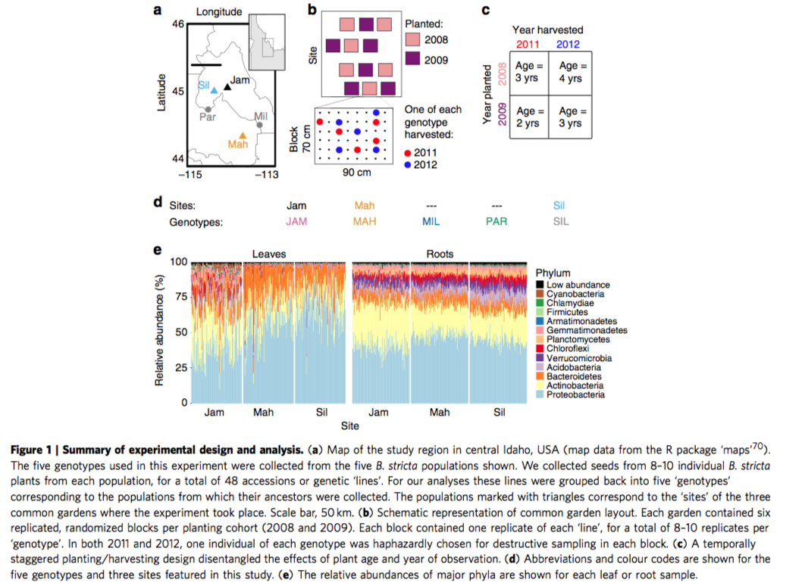

```{r setup, include=FALSE}
knitr::opts_chunk$set(echo = TRUE)
```

# Root and leaf microbiomes

The data in this practical are taken from Wagner *et al.* (2016; `doi:0.1038/ncomms12151 `). This is an in-depth comparison of the root and leave microbiomes (microbial community composition) in experimental populations of the wild mustard plant, *Boechera stricta* (Brassicaceae), investigated using metagenomic DNA sequencing. The plants were planted out carefully-designed plots under controlled conditions, and some individuals from each plot were removed each year, their roots and leaves harvested, and microbial DNA extracted and sequenced. The bioinformatics packages `QIIME` and `Phyloseq` were used to process the data, and statistical analysis was performed using `R` - just as you're about to do...

## Experimental design

The experimental design is given below:



*And also from the Results*:
```
These 616 samples represented 440 individual plants across three common gardens (sites), 36 experimental blocks (12 nested within each site), five genotypes (each encompassing 8–10 genetic lines, to represent additional variation within each genotype), 2 years of observation and three age groups (Fig. 1). The final data set included 27,763±15,790 observations per sample (mean±1 s.d.), comprising 3,718 operational taxonomic units (OTUs) after we removed contaminants and non-reproducible OTUs (see Methods)16 and corrected counts for 16S rRNA gene copy number variation34.
```
Questions:

 1. Which factors are blocks, and which are treatments?
 2. How many levels are there in this experiment?
 3. How many replicates? Are there any pseudoreplicates? Why?
 4. Is this design orthogonal? If not, why not?
 5. Is there anything else worth noting about the design?

## Model selection and fitting by heuristics

The data for this paper is held in Dryad, a large open-access repository of research paper data and analyses. If you want to explore it yourself, head to http://datadryad.org/resource/doi:10.5061/dryad.g60r3; I've simplified the data slightly for this practical. 

1. Open the file `wagner_2016_microbiome.tdf` by reading it into `R`. Inspect the data frame and verify that variables have imported correctly (categorical variables as factors, etc - *Hint, you may need to clean your data, or use the *`as.factor()` or `as.numeric()`*conversion functions*).

We are seeking to explain microbial diversity (measured by two variables, `CHAO1` and `Shannon`) using the available factors. To start with, let's try and fit a few models using the available parameters. There are a lot of variables here, so rather than eyeball each one separately, we can call `plot()` on the data.frame to produce simple pairwise scatterplots for all variables:

```{r eval=F}
plot(wagner)
```

2. There are actually two response variables in this dataset, which represent alternative measures of microbial diversity: `CHAO1` and `Shannon`. Which should we use, we wonder? Surely they should be highly correlated if both measure the same thing - but is there anything weird here? Try plotting them, and fitting a model (*BIG hint: check your assumptions!*)

What do you conclude? Try plotting each response variable as a histogram before you decide which to use as the response variable for the rest of the analysis.

3. Some of these look particularly interesting in relation to our response variable (either `CHAO1` or `Shannon`). Produce three boxplots of variables that seem like they may have explanatory power. 

4. Now fit a model using these terms. Start with a maximal model, and try to refine it to produce a minimal adequate model, by any means you see fit.

5. Did you forget to check anything? ;)

## Model selection by stepwise AIC

So far, so good - but there are a *lot* of possible combinations here. We'll use an automated model selection function, `step()` to have a go. 

5. Use the `step()` function to fit a model describing microbial diversity in terms of tissue (leaf/root), site, age, genotype, year, block, line, and MiSeq run, using forwards search. Start with a simple linear regression of age vs. diversity.
```{r eval=F}
# hint: here is the general syntax for forwards and backwards search
# backwards
backwards_final=step(lm(CHAO1 ~ habitat * sampling * block * site),direction="backward")
# forwards
forward_final=step(lm(CHAO1 ~ age * habitat),scope=(~age*habitat*block*sampling),direction="forward")
```

6. Write out the full model equation, including fitted terms, for the final model.

7. How does this compare to the model you produced by heuristic search in (3) above? *Hint: use *`anova()`

8. Now try the same thing, but this time start with a different model (any of your choosing). What do you notice?

9. Perform a backwards search (`direction=backward`), starting with a more complex model containing interaction terms (e.g. in `*` combination). What do you notice?

10. Finally, perform a bidirectional search, starting with your model from (3) above (`direction=both`). How does this compare to your model?
```{r eval=F}
# hint, here's the general form. Note that all terms in the starting model and lower model must be in upper (the maximal model)
final_final=step(lm(CHAO1~age*habitat),scope=c(lower=~habitat,upper=~ age* habitat * sampling * block * site),direction="both")
```

## Bonus question if you finish early

Hopefully by now, you won't find it hard to work out which variables are continuous, and which are categorical. Do this now - take a piece of paper and write them out. However... there is something special about `block` and MiSeq run - and something else special about `age` and planting/sampling year. Can you think that they are?


## Super-bonus

It's Friday! Enjoy the weekend, you've earnt it.

## Reference

Wagner MR, Lundberg DS, del Rio TG, Tringe SG, Dangl JL, Mitchell-Olds T (2016) Host genotype and age shape the leaf and root microbiomes of a wild perennial plant. *Nature Communications* **7**:12151. https://doi.org/10.1038/ncomms12151