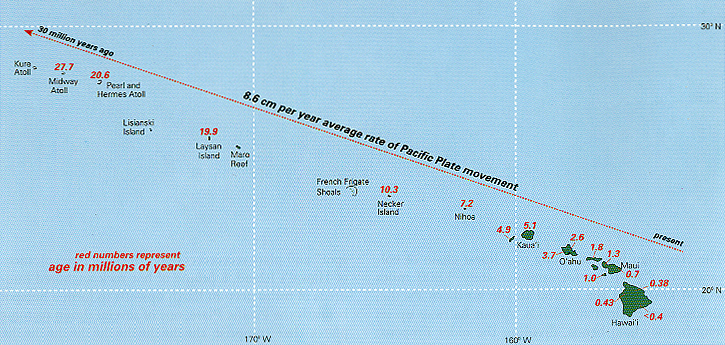
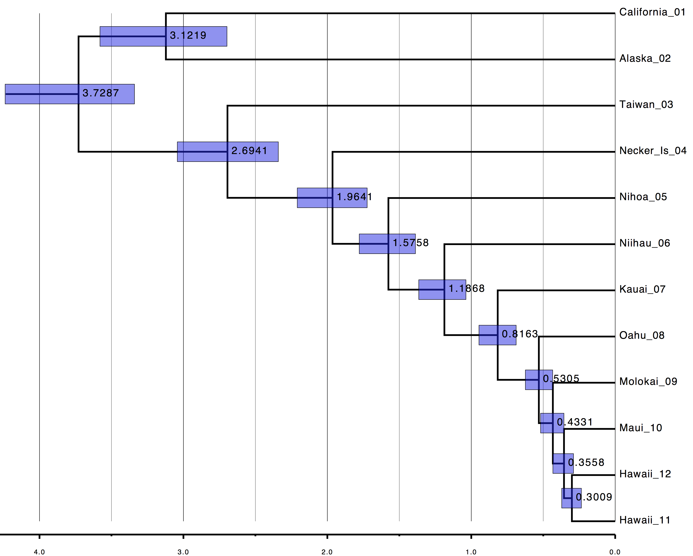

```{r setup, include=FALSE}
knitr::opts_chunk$set(echo = TRUE)
```

## Prerequisites

Software today; you'll need:

 - RAXML (try `raxml -v` on the command line, or `raxmlHPC -v`; if not you may need to `sudo apt-get raxml`)
 - `FigTree` and `beast`, both part of the BEAST package at http://beast.bio.ed.ac.uk

### Building RAxML

 1. Download the zip file from https://github.com/stamatak/standard-RAxML
 2. Extract to a folder
 3. `cd` into the folder and build RAxML from source:
 
```{bash eval=F}
# move into the right directory
cd <some folder>

# Build RAxML
make -f Makefile.gcc

# check it works
./raxmlHPC -v
```

## Part 1 – Phylogeography of island chains (30mins)

There are two datasets from two genera of flowering plants, both distributed on the Hawaiian islands. One is wind-dispersed, the other is dispersed by mammals. We will investigate their distributions and look for a phylogeographic pattern. A map of the islands is shown in Fig. 1. The islands themselves have formed at different times from a chain of seamounts arising from two tectonic plates:



**Fig. 1**: Major and outlying Hawaiian islands: Donch
 
We're going to use a program called RAxML to infer the tree. There are **many** possible parameters to supply, but for now:
```bash
raxml -s mc.paml -n model-gtrgammaiN20 -m GTRGAMMAI 
# where:
# -s = input sequence file (don't change this)
# -n = name of the analysis outputs- this must be unique for different runs 
#      RAxML won't let you overwrite existing files
# -m = the model describing the nucleotide evolution (see below)
```

Open the finished tree in FigTree, and compare the phylogeny with the map.

1) Which island do you think was colonised last? Why?

### Comparing models

There are a number of options we can use to vary the analysis:

| Option | Effect |
| ------ | ------ |
| -m <substitution model> | model can be one of 'GTRCAT', 'GTRCATI', 'GTRGAMMA', 'GTRGAMMAI' |
| -d | Use a random initial starting tree, instead of adding pairs of taxa sequentially |
| -N <integer> | Number of seperate starting trees

Try another model of substitution now, and open the best tree in FigTree again.

2) What is the difference between the two trees? Why? What is the difference in likelihood? Which has the 'better' fit?

It looks like the model choice affects the final likelihood, unsurprisingly. Try all four possible models - and tabulte their likelihoods now:

| Model | lnL |
| ----- | --- |
| GTRGAMMA | |
| GTRGAMMAI | |
| GTRCAT | |
| GTRCATI | |

Ask yourself:
 * Which has the best likelihood overall? 
 * Is this the 'best' model? 
 * How could you compare these models?
 * Is there any other information you'd need?

Finally we'll have a look at the starting tree options. Re-run RAxML with the second-best and best models from (2) above, this time with a random starting tree and -N = 20 runs. Compare the tree outputs and lnL values again.

3) What do you notice? Can you work out what's going on?

4) Have we reached a local or global optimum?


## Part 2 – Estimating dates of past events using BEAST (30mins)

Just as we learn in physics that `distance = (speed x time)`, the number of genetic substitutions between two related gene sequences will be a function of the rate at which random mutations occur, and the time that's elapsed since their most recent common ancestor ('MRCA'). This means that by assuming the rate of evolution has been steady over time, we can attempt to guess how old the clades in a tree are. The file `mc.paml_MCMC_slow.(time).MCC.tre` contains a tree that has branch lengths scaled using this process to reflect units of time (millions of years ago, MYA) instead of numbers of genetic changes. Open it in FigTree or see this example below (Fig 3):



**Fig. 2**: *Phylogeny showing MRCA dates estimated via a fixed molecular clock in BEAST.*

However, to perform this in `BEAST` (which implements this method using a sampling technique called 'MCMC') we also need to compare models as well as simply run the program. In Tracer, open the logfiles `simualted-HKY-strict-yule.log` and `simualted-HKY-exponential-coal-exponential.log`. These are outputs from two separate BEAST analyses of the same dataset, with differing models. Ask a demonstrator to explain them to you.

5) Which is the best fitting model?

6) How do they differ?

### Glossary of useful terms

+ **Alignment** – data (usually DNA or amino-acid sequences) that has been optimally arranged so homologous positions can be compared. May include '-' characters known as 'gaps' to pad out shorter sequences where nucleotides/amino acids have been deleted during evolution (aka 'indels')
+ **Bayesian inference** – phylogeny can be inferred using a likelihood function to produce posterior probabilities for a tree and then infer the most likely tree for a given dataset.
+ **Branch** – a line that represents the path of evolutionary history within a phylogeny
+ **Clade** – a group of taxa in a phylogeny that share character(s) from a single hypothetical ancestor
+ **Likelihood** – is defined to be a quantity proportional to the probability of observing the data given
the model. Usually expressed in log-likelihood units, abbreviated as 'lnL'
+ **MCMC** – Markov chain Monte Carlo methods are algorithms. They can be used for sampling probability distributions
+ **Node** – the position in a tree where branches separate. Each ‘node’ represents a real or hypothetical ancestor
+ **Phylogeny** – evolutionary tree inferred from a dataset (often DNA sequences)
+ **Posterior probability** - the probability of assigning observations to groups given the data
+ **Tip** – the tips of a tree normally represent the extant (living) taxa that were sampled
+ **Taxon** – the formal name of an organism or group of organisms


## Part 3: Harder models from yesterday

If you want to try something hard, I've hidden some high points in `shape.tdf`. They are x, y, and z co-ordinates, but to keep things simple the z-coordinates only take on 0 or 1 values, like the line example. Load up the .tdf file and look at the data. I've writen a quick plot surface to help you visualise the data:
```{r}
# set up
shape_x = runif(3000,-5,5)
shape_y = runif(3000,-5,5)
shape_z = 0
shape=data.frame(shape_x,shape_y,shape_z)

# add a circle
shape$shape_z[(shape$shape_x^2+shape$shape_y^2)<=2] = 1

# write out
write.table(shape,"shape.tdf",sep="\t",col.names=T)

# translate to be cheeky and scale
shape_translated_x = shape_x + 3.5
shape_translated_y = shape_y / 1.5
shape_translated = data.frame(shape_translated_x,shape_translated_y,shape$shape_z)
shape_translated$shape.shape_z = shape_translated$shape.shape_z + rnorm(length(shape_x),0,0.1)
write.table(shape_translated,"hard_shape.tdf",sep="\t",col.names=T)

# custom plotting function
plot_shape = function(shape_data){
  plot(shape_data[,1],shape_data[,2],col="light grey",pch=4)
  points(shape_data[shape_data[,3]>0.5,1],shape_data[shape_data[,3]>0.5,2],col="black",pch=19)
}

plot_shape(shape)
plot_shape(shape_translated)

```

```{r}
# custom plotting function
plot_shape = function(shape_data){
  plot(shape_data[,1],shape_data[,2],col="light grey",pch=4)
  points(shape_data[shape_data[,3]>0.5,1],shape_data[shape_data[,3]>0.5,2],col="black",pch=19)
}

```

Can you fit this? **Hint: the line equation for a circle is all points that exactly satisfy `x^2 + y^2 == 1`...**

## Finally...

If you really, really want to stretch yourself, try `hard_shape.tdf`. **Hint you might want to think about translations...**